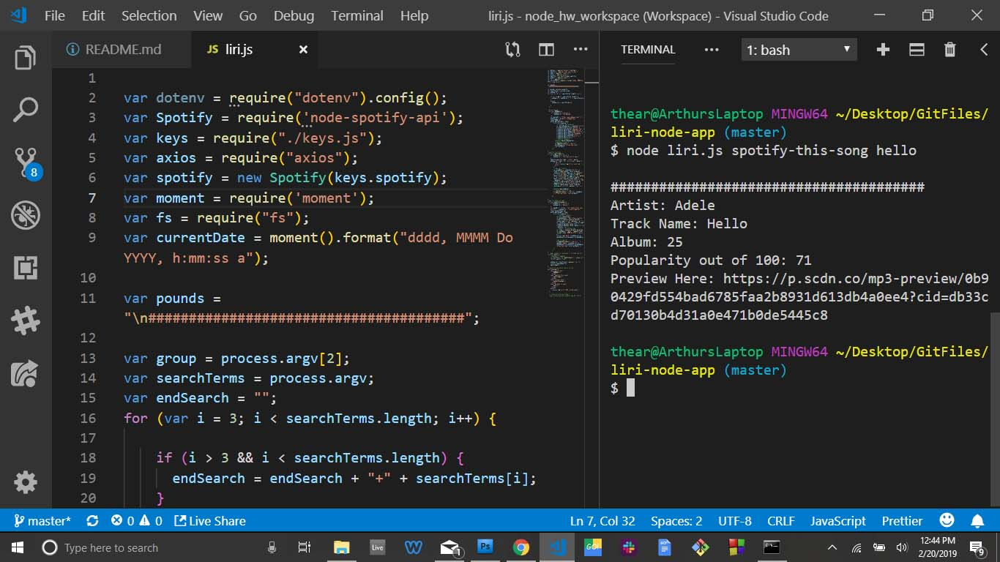
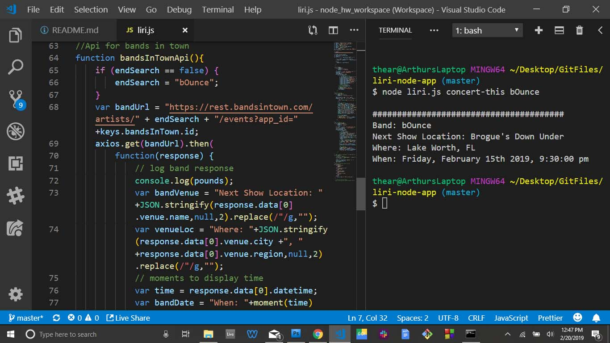
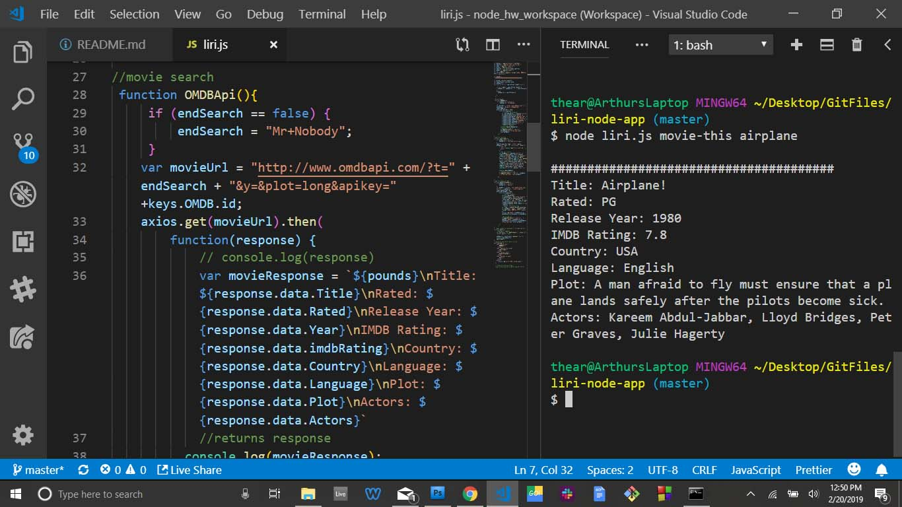
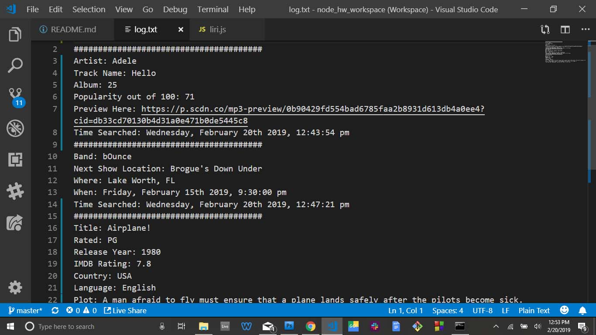
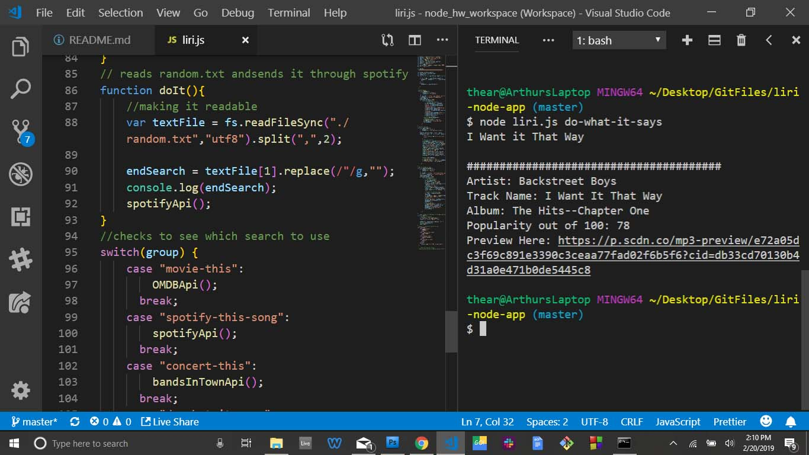

# liri-node-app

### This is a "SIRI" like app that will take in command line instructions to search 
* bands in town
* movies
* spotify
* also you can search spotify through the random.txt file (literaly)

# how to use it

for bands in town write: node liri.js concert-this (band name)

for spotify search: node liri.js spotify-this-song (song name)

for movie search: node liri.js movie-this (movie title)

# Linking your Keys

### Create a file named `.env`, add the following to it, replacing the values with your API keys (no quotes) once you have them:

```js
# Spotify API keys

SPOTIFY_ID=your-spotify-id
SPOTIFY_SECRET=your-spotify-secret

# OMDB API keys
OMDB_ID=your-OMDB-key

bandsInTown_ID=your-bandsInTown-key

```

# Screenshots

### Song Search



### Band Search



### Movie Search



### It will also automatically create a time stamped search log



### Not sure why, but incase you wanted it to spotify something from a random.txt file, you can do that too...



#  

### Here is a [video](https://drive.google.com/file/d/1OpisLJ-36KB_Ed3CoM7XJwz6SGTUuSQ1/view) of the working version!

### Please check out more fun things on [My Portfolio](https://theartofnoise.github.io/Bootstrap-Portfolio/)!!
